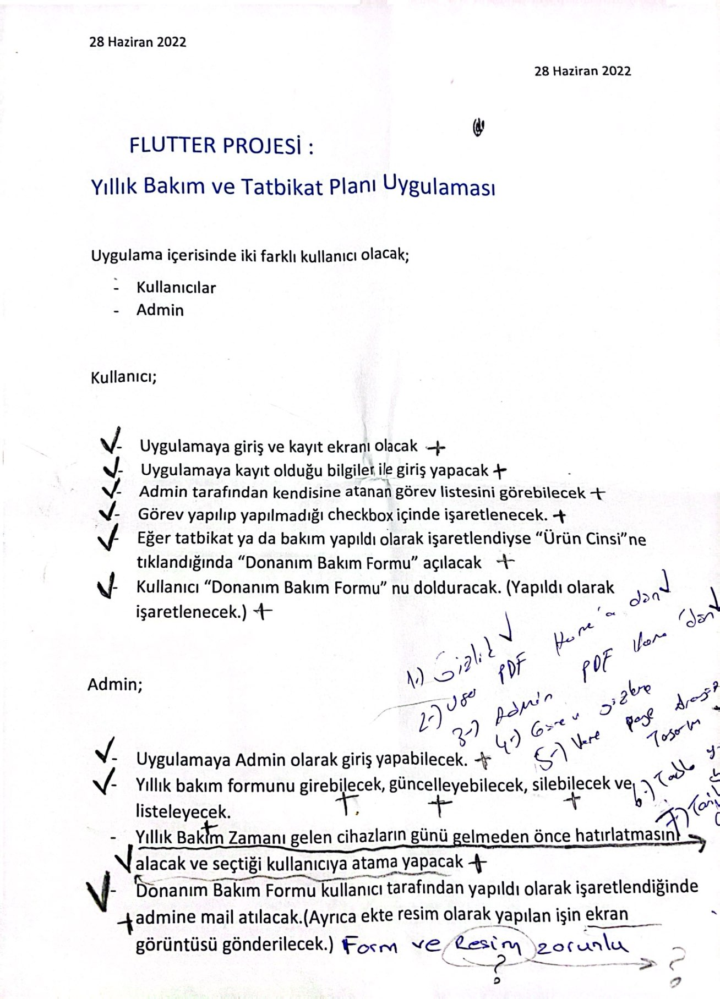
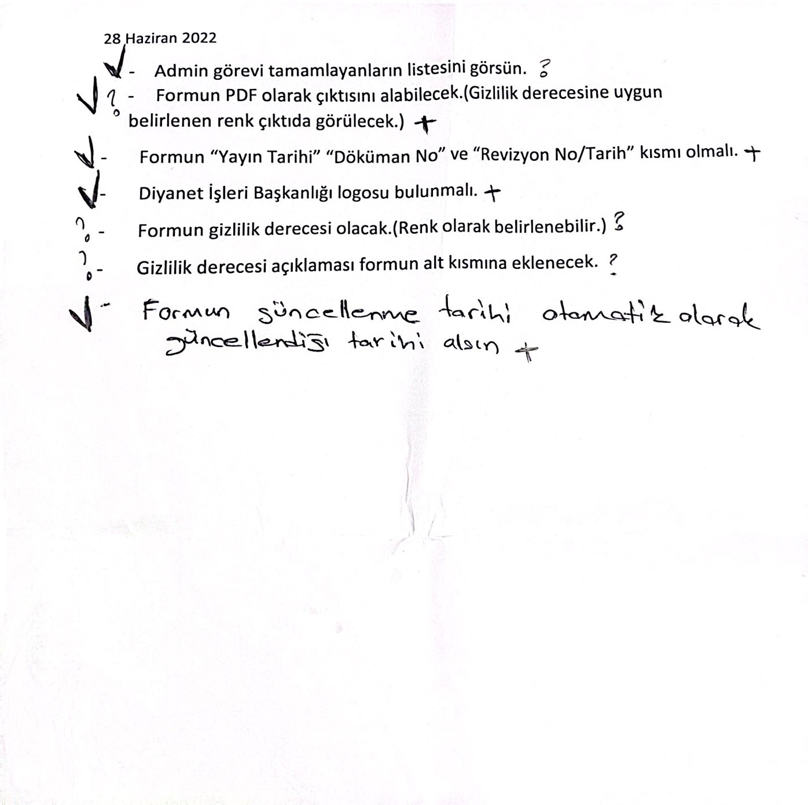
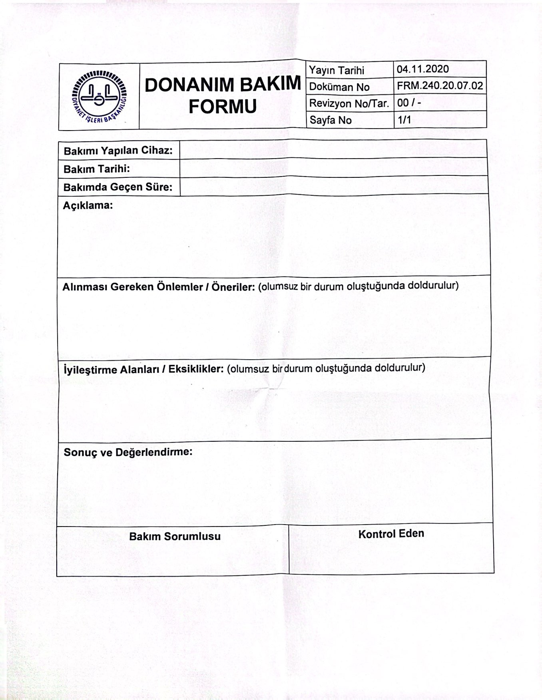
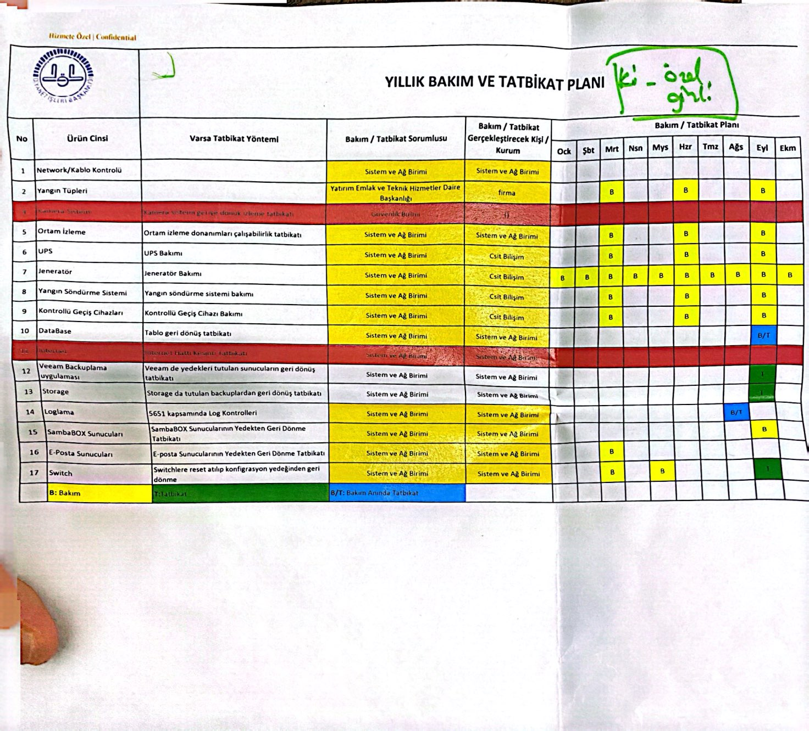

# Yıllık Bakım ve Tatbikat Planı Uygulaması
## Annual Maintenance and Exercise Plan Application(en)

Bu mobil uygulama, Sistem ve Network ekibinin ihtiyaçlarına göre hazırlanmış, gerekli yıllık bakım ve tatbikat planına uygun olarak görev atama ve takibi işlevini yerine getirir.

This mobile application performs the task assignment and tracking function in accordance with the required annual maintenance and exercise plan prepared according to the needs of the System and Network team.(en)

-> Developed using Flutter framework.

-> Utilized sqflite for database management.

-> The database comprises 5 tables.

-> Implemented CRUD operations.

-> Executed other business-specific operations.

-> Incorporated cross tables for enhanced functionality.

## İsterler Raporu ve Formlar

  
